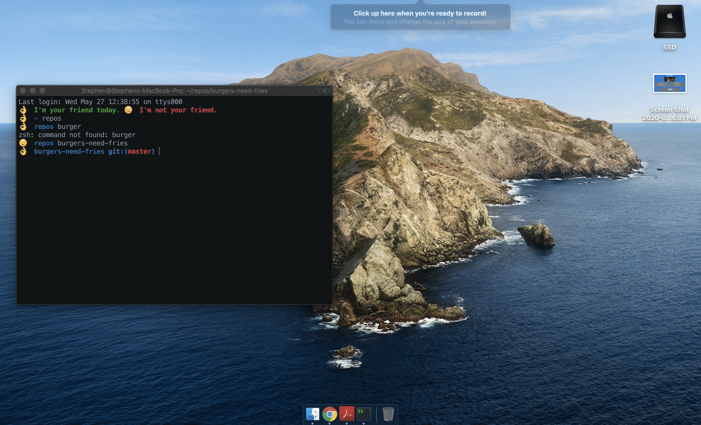

# burgers-need-fries
This app, created with mySQL, Node, Express, Handlebars and a homemade ORM, logs burgers you want to eat. 
## Table of Contents
1. [Description](#description)
2. [Future development](#FutureDevelopment)
3. [Installation](#installation)
4. [Contributing](#contributing)
5. [License](#license)



## Description
Few things are a better for a meat-lover than a tasty burger. Keep track of all your favorites by adding them to your log. Burgers you want to eat are displayed on the left, while burgers you have already eaten are displayed on the right. 

The application can be started with this command:

```sh
node server.js
```

The user will be told what port the app is being served on and can go to `localhost:` in the web browser.

The application is also located on Heroku at this link:
https://blooming-fjord-50965.herokuapp.com/

## Future development
The app currently has "Devour It" buttons next to each burger. Those buttons don't function right now. I would like to add that functionality in the next few days and then include this assignment on my portfolio. 

## Installation

Run `npm install` to include all necessary dependencies.

## Contributing

Contributions and improvements to the project are welcome at any time. 

### License
[](https://opensource.org/licenses/MIT)